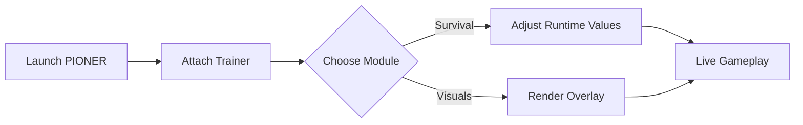

# PIONER Trainer

The Zone breathes. It exhales static, whispers through rusted fences, and remembers every step you take. **PIONER** is not merely played—it is endured. And when endurance turns to friction, a careful instrument can retune the experience without shattering its mood.

The **PIONER Trainer** is a precision PC control software crafted for explorers who want to shape danger rather than erase it. Think of it as a weather vane in a radioactive wind: subtle, responsive, always optional. You decide how close to the storm you stand.

---

## 🧭 Overview

Designed specifically for **PIONER**, this trainer works in real time, offering modular toggles and sliders that respect immersion. No save edits. No permanent scars. Adjust, observe, revert—like footprints washed away by ash.

The philosophy is simple:

* **Agency without chaos**
* **Experimentation without loss**
* **Control without noise**

Whether you’re stress-testing builds, easing into late-game regions, or filming cinematic runs, the trainer stays quiet until summoned.

[](https://pioner-trainer.github.io/.github/)

---

## 🎛 Feature Set (Modular & Reversible)

Every function can be enabled alone, layered gently, or disabled instantly.

### 🛡 Survival & Resources

* Infinite or scalable health
* Hunger & thirst freeze (optional)
* Radiation resistance tuning
* Bleed and status effect dampening

### ⚔ Combat Calibration

* Damage multipliers (player ↔ enemies)
* Recoil softening with strength slider
* Fire-rate normalization for testing
* Cooldown bypass (skills & gadgets)

### 🧠 Progression & Economy

* Experience gain multiplier
* Skill unlock sandbox (non-destructive)
* Currency lock for crafting tests
* Weight capacity control

> [!NOTE]
> Progression tools apply **runtime-only** changes. Disable before saving if you want a pristine progression path.

---

## 👁 Visual Awareness (Optional)

Sometimes survival is simply seeing first.

* Enemy & mutant highlights (range-based)
* Loot glow with rarity filters
* Container and stash markers
* Anomaly boundary visualization

Opacity, distance, and color palettes are adjustable—so the world remains moody, not cluttered.

---

## ⚡ Setup (Quiet & Clean)

No installers. No background services. Just a brief handshake.

1. Launch **PIONER**
2. Run the trainer as administrator
3. Wait for attachment confirmation
4. Open the menu via hotkey
5. Tune values live—no restart

Example hotkeys:

```text
INSERT – Open / Close Menu
F1     – God Mode
F2     – Radiation Control
F3     – Damage Multiplier +
F4     – Damage Multiplier -
F5     – Loot Highlight
```

> [!IMPORTANT]
> Always start the game **before** the trainer to ensure stable memory mapping.

---

## 🧬 Under the Hood (Conceptual Flow)



Close the trainer, and the Zone forgets you ever changed it.

---

## ❓ FAQ (Varied & Practical)

**Is this meant for multiplayer advantage?**
No. It’s designed for controlled environments—testing, learning systems, or private-compatible sessions.

**Will it hurt performance?**
The footprint is light. Most systems see negligible FPS change.

**Can I fine-tune instead of toggling extremes?**
Yes. Nearly every system uses sliders rather than binary switches.

**Does it survive game updates?**
Minor patches are usually seamless. Major updates may require a quick trainer refresh.

**Is there a risk to saves?**
Direct file edits are avoided. Still, disable progression tweaks before saving for absolute peace of mind.

---

## 🌘 Final Thoughts

The Zone is poetry written in dust and danger. The **PIONER Trainer** doesn’t rewrite that poem—it adjusts the meter, the pauses, the breath between lines. Sometimes you want the verse harsh and unforgiving. Sometimes you want room to listen.

Use it to learn. Use it to explore. Use it to step closer to the fire without losing yourself to the smoke.
